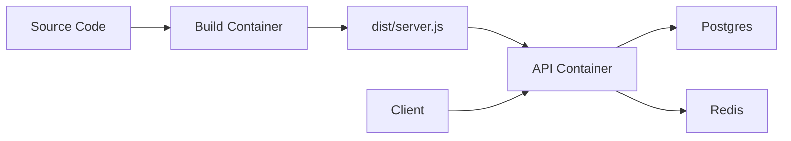
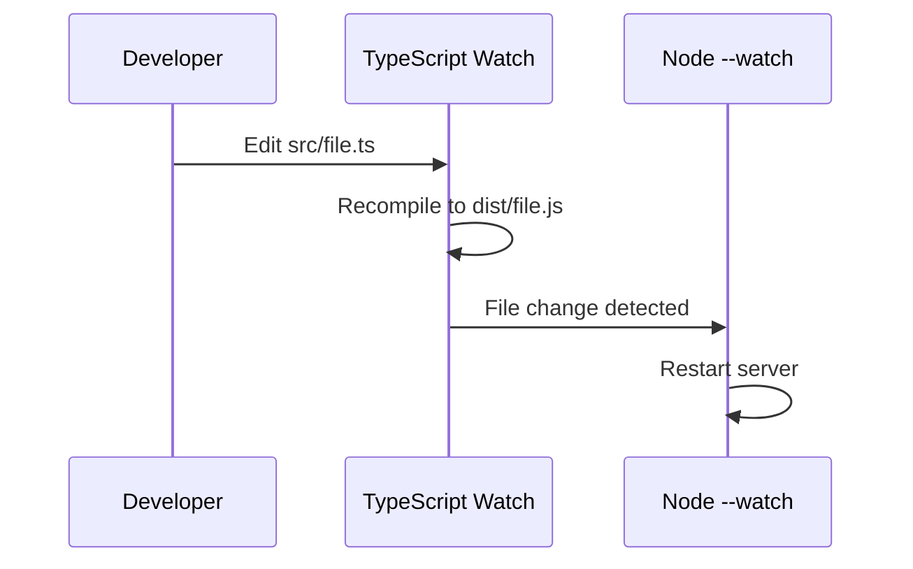
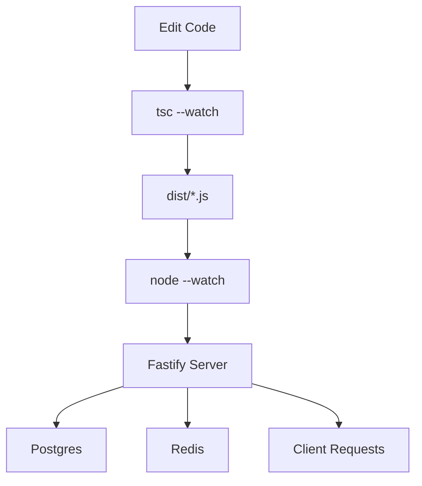

TODO: rewrite from this ChatGPT starting point.

# Infrastructure Documentation (infra.md)

This document explains how your Docker-based development setup works, why it feels fast, how hot-reloading (HMR) is achieved, and how development approximates production.

---

# 🧠 High-Level Overview

Your system is composed of **4 containers**:

* `build` → TypeScript compiler in watch mode
* `api` → Runs the Node.js server
* `postgres` → Database
* `redis` → Cache/session store

These containers work together to create a **live-reloading backend environment**.

---

# 🏗️ Architecture Diagram



---

# ⚙️ How Startup Works (Why It Feels Fast)

When you run:

```bash
npm run system:up
```

Docker Compose starts all services **in parallel**.

## Step-by-step

### 1. `build` container starts

Runs:

```bash
npx tsc --build --watch
```

* Compiles TypeScript → `dist/`
* Stays running
* Rebuilds automatically on file changes

---

### 2. `api` container starts

Runs:

```bash
until [ -f dist/server.js ]; do sleep 0.1; done && node --watch dist/server.js
```

This is the key to the "fast startup":

* It **does NOT build anything**
* It simply waits until the build container produces output
* Then instantly starts Node

👉 No dependency installation
👉 No compilation delay inside API container

---

### 3. Postgres & Redis start

* Start independently
* API connects using environment variables

---

# 🚀 Why It Starts So Fast

Because responsibilities are split:

| Responsibility | Container |
| -------------- | --------- |
| Compilation    | build     |
| Execution      | api       |

This avoids:

* Rebuilding TypeScript on every restart
* Blocking startup on compilation

👉 The API container is basically just:

```bash
node dist/server.js
```

Which is extremely fast.

---

# 🔥 Hot Reloading (HMR)

Your setup uses **two layers of watching**:

## 1. TypeScript Watch (Compiler Layer)

Inside `build`:

```bash
tsc --watch
```

* Watches `src/**/*.ts`
* Recompiles into `dist/`

---

## 2. Node Watch (Runtime Layer)

Inside `api`:

```bash
node --watch dist/server.js
```

* Watches compiled JS files
* Restarts server when files change

---

## 🔄 Combined Flow



👉 This is your "HMR"

Note: It's technically **process restart**, not true module-level HMR.

---

# 📦 Volume Mounting (Critical Concept)

```yaml
volumes:
  - .:/app
```

This means:

* Your local files are **shared with containers**
* No copying needed after startup
* File changes are instantly visible

👉 This is what enables live reload.

---

# 🧪 Dev vs Production

## Development Setup (docker-compose)

* Uses bind mounts (`.:/app`)
* Uses watchers (`tsc --watch`, `node --watch`)
* Uses raw Node execution

---

## Production Setup (Dockerfile)

```dockerfile
FROM node:20-alpine
WORKDIR /app

COPY package*.json ./
RUN npm ci --omit=dev

COPY . .
RUN npm run build

CMD ["node", "dist/server.js"]
```

### Key Differences

| Aspect       | Dev          | Prod               |
| ------------ | ------------ | ------------------ |
| Build        | Live (watch) | Prebuilt           |
| Dependencies | Shared       | Installed in image |
| File system  | Mounted      | Immutable          |
| Startup      | Instant      | Slightly slower    |

---

# ⚖️ Dev/Prod Parity (Why This Setup Is Good)

Even though dev uses watchers, parity is maintained because:

### Same runtime

* Both use Node
* Both run `dist/server.js`

### Same build output

* Dev: built by `tsc --watch`
* Prod: built by `npm run build`

### Same environment variables

```yaml
environment:
  DATABASE_URL
  REDIS_URL
  SESSION_SECRET
```

👉 Meaning behavior is consistent.

---

# 🧱 Container Responsibilities

## Build Container

* Compiles TypeScript
* Runs forever
* No networking responsibility

---

## API Container

* Runs Fastify server
* Handles HTTP requests
* Connects to DB & Redis

---

## Postgres

* Persistent storage
* Data stored in:

```bash
./.local/postgres-data
```

---

## Redis

* Session storage / caching
* Ephemeral by default

---

# 🔐 Environment Variables

Your API depends on:

* `DATABASE_URL`
* `REDIS_URL`
* `SESSION_SECRET`

These must exist in a `.env` file.

---

# ⚠️ Subtle Issues / Improvements

## 1. Node version mismatch

* build → node:20
* api → node:25

👉 This can cause inconsistencies.

**Recommendation:** use same version.

---

## 2. Not true HMR

You're using restart-based reload.

If you wanted real HMR:

* Use `tsx watch` OR
* Use frameworks like NestJS / Vite-based backend

---

## 3. Dockerfile not used in dev

Your compose file uses:

```yaml
image: node:20-alpine
```

👉 Not your Dockerfile.

So dev ≠ containerized prod image.

---

# 🔄 Full System Flow



---

# 🧠 Mental Model (Simplified)

Think of your system as:

> "One container builds, another runs."

* Build container = TypeScript compiler daemon
* API container = Node runtime daemon

They communicate through the **filesystem (`dist/`)**.

---

# 📌 Summary

Your setup is fast because:

* Compilation is decoupled from execution
* Containers share filesystem
* API starts instantly when build output exists

Your HMR works because:

* TypeScript recompiles
* Node restarts on file change

Your dev/prod parity works because:

* Both run compiled JS
* Same runtime behavior

---

# 🚧 If You Want To Go Deeper

You could next explore:

* Multi-stage Docker builds
* Using your Dockerfile inside docker-compose
* Replacing Node watch with `tsx`
* Adding healthchecks for Postgres/Redis

---

End of document.
